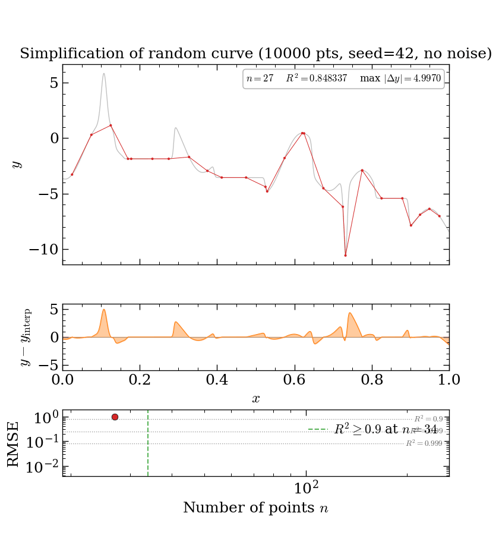
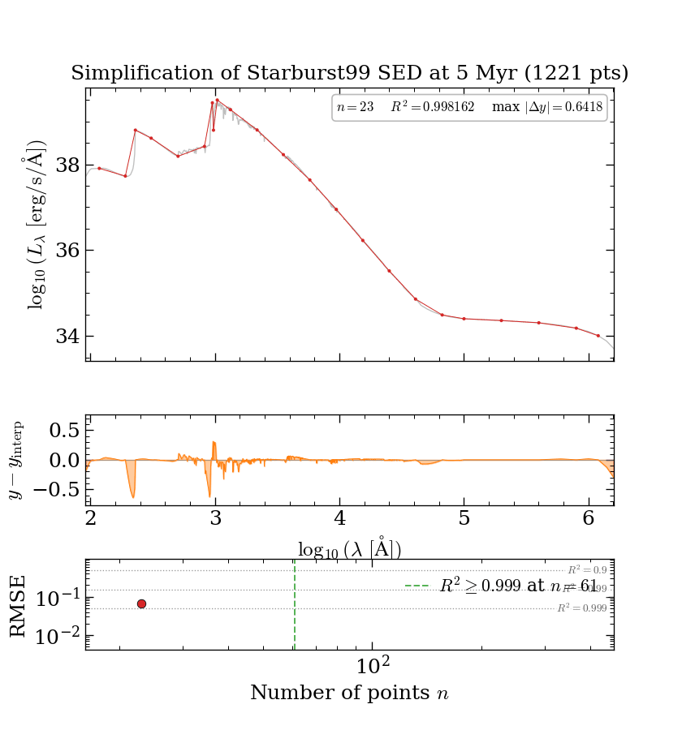
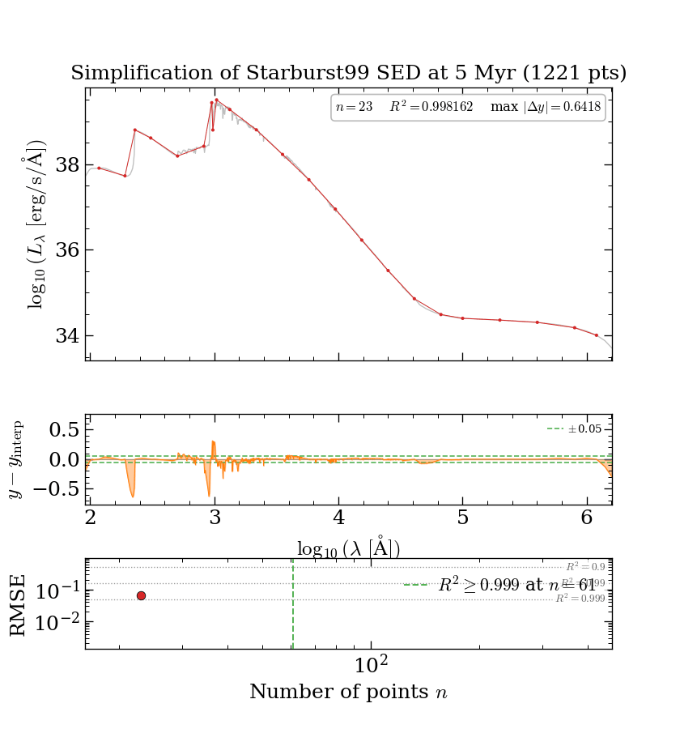

# simplify

Heuristic downsampling of 1-D curves while preserving sharp bends, local
extrema, and overall shape. Single file, no dependencies beyond NumPy.



The animation progressively adds points to a 10 000-point random test
curve (seed 42, no noise).  Three panels: the simplified overlay (top),
the signed residual showing where the approximation over-/undershoots
(middle), and RMSE vs point count on a log-log scale (bottom).  R² ≥ 0.9
is first reached at **n = 57** (green dashed line).  Generated with:

```bash
python simplify.py --random --seed 42 --no-noise --animate demo_nonoise.gif --animate-duration 5
```

### Real data — Starburst99 5 Myr SED

| `R² ≥ 0.999` | `R² ≥ 0.999` + `max_err = 0.05` |
|:---:|:---:|
|  |  |
| 1221 pts → **38** pts (32× compression) | 1221 pts → **105** pts (12× compression) |

The curve is the Starburst99 `LOG (TOTAL)` SED column at 5 Myr
(instantaneous burst, Z = Z☉) — a real astrophysical spectrum spanning
91 Å to 1.6 × 10⁶ Å in wavelength and ~6 dex in luminosity.  `x` is
`log10(λ/Å)` and `y` is `log10(L_λ / (erg s⁻¹ Å⁻¹))`.  The left GIF
uses only the R² target: 38 points achieve R² > 0.999, but the
worst-case error in the UV bump is still 0.51 dex (3.2×).  The
residual panel makes this immediately visible — R² is a global
average and hides large local errors.  The right GIF adds
`max_err = 0.05`, which inserts points at the worst-error locations
until no point deviates by more than 0.05 dex (≈ 12 %), yielding 105
points.  Generated with:

```bash
python simplify.py --randomSB99 --animate demo_sb99_loose.gif --animate-duration 6 --r2-target 0.999
python simplify.py --randomSB99 --animate demo_sb99_tight.gif --animate-duration 6 --r2-target 0.999 --max-err 0.05
```

## Quick start

```bash
python simplify.py --random --no-noise --animate simplify.gif
```

Generates a synthetic test curve and an animated GIF of the
simplification process. Other quick demos:

```bash
python simplify.py --random --metrics                          # error table
python simplify.py --random --plot                             # comparison plot
python simplify.py --random --animate demo.gif --r2-target 0.95  # tighter fit
python simplify.py --randomSB99 --animate sb99.gif --r2-target 0.999  # real SED data
python simplify.py --randomSB99 --max-err 0.05 --animate sb99_tight.gif  # bounded error
```

## Command line

```bash
python simplify.py data.csv -o reduced.csv                    # basic
python simplify.py data.csv --metrics --plot                   # inspect quality
python simplify.py data.csv --r2-target 0.95                   # tighter R² target
python simplify.py data.csv --r2-target 0.8                    # aggressive compression
python simplify.py data.csv --max-err 0.1                      # bound worst-case error
python simplify.py data.csv --animate output.gif               # animation
python simplify.py data.csv --grad-inc 0.5                     # lower curvature threshold
```

Run `python simplify.py --help` for all options.

## Python API

```python
import numpy as np
from simplify import _simplify, _simplify_error, _simplify_plot

x = np.linspace(0, 10, 10000)
y = np.sin(x) + 0.5 * np.sin(5 * x)

# Simplify (default R² target = 0.9)
x_s, y_s = _simplify(x, y)

# Tighter quality target
x_s, y_s = _simplify(x, y, r2_target=0.99)

# Keep all feature-detected points (no R² thinning)
x_s, y_s = _simplify(x, y, r2_target=None)

# Bound the worst-case pointwise error
x_s, y_s = _simplify(x, y, max_err=0.1)

# Error metrics
metrics = _simplify_error(x, y, x_s, y_s)
print(f"R² = {metrics['r_squared']:.4f}, compression = {metrics['compression']:.1f}x")

# Plot
_simplify_plot(x, y, x_s, y_s, save_path="comparison.png")
```

## Algorithm

Three independent feature detectors populate a candidate pool, a
topological-persistence filter promotes the visually important extrema
to a mandatory set, an R²-driven binary search picks the smallest
subset that meets the quality target, an optional greedy loop bounds
the worst-case pointwise error, and a final collinearity pass removes
points that lie on the line between their neighbours:

1. **Scale-invariant bend detection** — both the discrete Menger
   curvature and the turning angle between adjacent segments are
   computed in *normalised* `(x, y)` coordinates (both rescaled to
   `[0, 1]`). A point is flagged when either curvature exceeds
   `grad_inc` or the turning angle exceeds `0.1 * grad_inc` radians.
   The two detectors are complementary: curvature catches tight
   corners (shocks, vertical drops), the angle detector catches wide,
   gentle bends whose triplet triangle is too large for curvature
   alone to fire. Running in normalised coordinates makes `grad_inc`
   dimensionless — the same value works at any axis scale.

2. **Sign-change detection** — keeps every point where the first
   derivative changes sign. Sub-noise extrema (prominence below
   0.5 % of the y-range) are dropped so noise-driven sign flips on
   near-flat regions do not flood the candidate pool.

3. **Cumulative-distance sampling** — divides the total variation of y
   (`sum(|diff(y)|)`) into `nmin` equal bins and selects one point at
   each bin boundary. Dense where y changes rapidly, sparse where flat.

4. **Topological persistence (mandatory set)** — for each extremum,
   `_peak_prominences` computes the peak prominence (minimum descent
   from a local max, or ascent from a local min, needed to reach a
   strictly more extreme point) in a single O(n log n) monotonic-stack
   pass. Extrema with prominence ≥ 5 % of the y-range are marked
   **mandatory** and included in every trial subset, so big features
   never flicker in and out with changing `n`. Extrema below 0.5 % are
   dropped as noise (step 2).

4b. **X-uniform mandatory coverage** — global R² is amplitude-weighted,
   so a low-amplitude gradual region contributes almost nothing to
   `SS_tot` and the bisection would happily drop every candidate in it
   once bigger features already hit the target.  To prevent this, the
   x-domain is split into `n_chunks = 20` equal-width chunks and the
   feature-pool point nearest each chunk centre is promoted into the
   mandatory set alongside the prominent extrema.  This thin x-uniform
   skeleton guarantees every part of the x-axis gets at least one
   retained point, independent of amplitude.

5. **R²-based thinning** — the remaining candidates are traversed in
   hierarchical bisection order (endpoints → midpoint → quartiles → …)
   so trial subsets are strictly nested. A binary search plus a
   3-in-a-row stability check picks the smallest `k` for which
   `mandatory ∪ bisection[:k]` reaches `r2_target`.

5b. **Greedy max-error reduction** — R² is a global average, so a
   large local error can hide behind a high R² value (e.g. 0.64 dex
   worst-case at R² = 0.998).  When `max_err` is set, a greedy loop
   runs after R²-thinning: at each iteration it finds the original
   data point with the largest interpolation error and inserts it
   into the retained set, repeating until the worst-case absolute
   error drops below `max_err`.  Points inserted by this loop are
   protected from the subsequent collinearity prune.

6. **Collinearity prune** — a vectorised sweep drops any point whose
   y value is within 0.1 % of the y-range of the chord between its
   two surviving neighbours. Endpoints and mandatory extrema are
   protected. This removes the redundant samples the bisector leaves
   on linear and horizontal segments.

## Parameters

| Parameter | Default | Description |
|-----------|---------|-------------|
| `nmin` | 100 | Target minimum output samples for distance sampling |
| `grad_inc` | 1.0 | Bend sensitivity (dimensionless, scale-invariant); fires when Menger curvature in normalised coords > `grad_inc`, or turning angle > `0.1 * grad_inc` rad |
| `r2_target` | 0.9 | Target R²; set to `None` to keep all detected points |
| `max_err` | `None` | Maximum allowed absolute interpolation error.  After R²-thinning, a greedy loop inserts points until the worst-case error drops below this value.  Operates in the same y-space as the pipeline (log10 when `log_y` is active, so `0.1` means ≤ 0.1 dex ≈ 26 % multiplicative). |
| `log_y` | `"auto"` | Work in log-y space for every internal feature detector and the R² thinning step.  `"auto"` activates when every `y > 0` and `max(y)/min(y) > 100`; pass `True` / `False` to force. |
| `n_chunks` | 20 | Number of equal-x-width chunks whose nearest feature-pool point is promoted to mandatory (x-uniform coverage floor).  Smaller for aggressive compression on uniformly-busy curves; larger when low-amplitude gradual regions need finer minimum coverage. |

## Multi-decade data (density, temperature, flux profiles)

Astrophysical profiles that span several orders of magnitude — e.g.
density or temperature inside an interstellar bubble, where ISM
(~1 cm⁻³) to shocked shell (~10⁶ cm⁻³) is routine — need log-y
handling, because linear R² and the linear cumulative-distance sampler
are both dominated by the peak amplitude.  `log_y="auto"` (the
default) switches every internal detector onto `log10(y)` when the
input is strictly positive and spans ≥ 2 decades; the output arrays
still contain the caller's raw `y` values.

On a synthetic bubble profile with a 4.5 × 10⁶ dynamic range and the
default `r2_target=0.99`:

| mode | n kept | linear R² | log R² | worst-case log deviation |
|------|-------:|----------:|-------:|-------------------------:|
| `log_y=False` (classic) | 13 | 0.991 | 0.27 | **2.37 dex** (≈ 250× off) |
| `log_y="auto"` (default) | 32 | 0.9995 | **0.9995** | **0.13 dex** (≈ 37 % multiplicative) |

The `_simplify_error` helper and the CLI's `--metrics` flag report
`log_r_squared`, `log_rms_err`, and `log_max_dex_err` whenever `y` is
strictly positive, so quality assessments on such data are in the
right scale by default.  When rendering, use `plt.semilogy` (or equivalent)
on the simplified points — that interpolates between them in log-y
space, which is what the algorithm's internal quality target assumed.

## Dependencies

- **numpy** (required)
- **matplotlib** (optional — plotting and animation)
