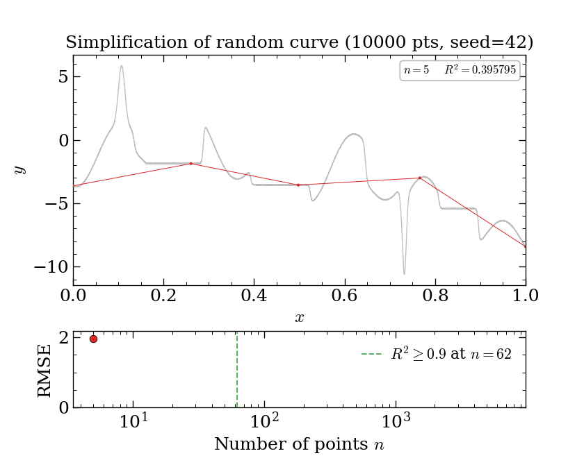

# simplify

Heuristic downsampling of 1-D curves while preserving sharp bends, local
extrema, and overall shape. Single file, no dependencies beyond NumPy.



The animation above was produced with:

```bash
python simplify.py --random --seed 42 --animate demo.gif --animate-duration 5
```

It progressively adds points to a 10 000-point noisy test curve and
stops once R² ≥ 0.9 (green dashed line, here at n = 36). The bottom
panel shows RMSE on a log-log scale with dashed reference lines at
R² = 0.9, 0.99, 0.999 so the remaining distance to a perfect fit is
visible at a glance.

## Quick start

```bash
python simplify.py --random --animate simplify.gif
```

Generates a synthetic test curve and an animated GIF of the
simplification process. Other quick demos:

```bash
python simplify.py --random --metrics                          # error table
python simplify.py --random --plot                             # comparison plot
python simplify.py --random --animate demo.gif --r2-target 0.95  # tighter fit
```

## Command line

```bash
python simplify.py data.csv -o reduced.csv                    # basic
python simplify.py data.csv --metrics --plot                   # inspect quality
python simplify.py data.csv --r2-target 0.95                   # tighter R² target
python simplify.py data.csv --r2-target 0.8                    # aggressive compression
python simplify.py data.csv --animate output.gif               # animation
python simplify.py data.csv --grad-inc 0.5                     # lower curvature threshold
```

Run `python simplify.py --help` for all options.

## Python API

```python
import numpy as np
from simplify import _simplify, _simplify_error, _simplify_plot

x = np.linspace(0, 10, 10000)
y = np.sin(x) + 0.5 * np.sin(5 * x)

# Simplify (default R² target = 0.9)
x_s, y_s = _simplify(x, y)

# Tighter quality target
x_s, y_s = _simplify(x, y, r2_target=0.99)

# Keep all feature-detected points (no R² thinning)
x_s, y_s = _simplify(x, y, r2_target=None)

# Error metrics
metrics = _simplify_error(x, y, x_s, y_s)
print(f"R² = {metrics['r_squared']:.4f}, compression = {metrics['compression']:.1f}x")

# Plot
_simplify_plot(x, y, x_s, y_s, save_path="comparison.png")
```

## Algorithm

Three independent feature detectors populate a candidate pool, a
topological-persistence filter promotes the visually important extrema
to a mandatory set, and an R²-driven binary search picks the smallest
subset that meets the quality target:

1. **Menger curvature detection** — computes the discrete curvature
   (reciprocal of circumradius) for each triplet of consecutive
   points. Keeps points where curvature exceeds `grad_inc`. Captures
   shocks, discontinuities, and phase transitions.

2. **Sign-change detection** — keeps every point where the first
   derivative changes sign, i.e., every local minimum and maximum.

3. **Cumulative-distance sampling** — divides the total variation of y
   (`sum(|diff(y)|)`) into `nmin` equal bins and selects one point at
   each bin boundary. Dense where y changes rapidly, sparse where flat.

4. **Topological persistence (mandatory set)** — for each extremum,
   `_peak_prominences` computes the peak prominence (minimum descent
   from a local max, or ascent from a local min, needed to reach a
   strictly more extreme point). Extrema with prominence ≥ 5 % of the
   y-range are marked **mandatory** and included in every trial subset,
   so big features never flicker in and out with changing `n`. The
   computation is O(n log n) via monotonic-stack prev/next-greater
   indices plus a sparse-table range-min query.

5. **R²-based thinning** — the remaining candidates are traversed in
   hierarchical bisection order (endpoints → midpoint → quartiles → …)
   so trial subsets are strictly nested. A binary search plus a
   3-in-a-row stability check picks the smallest `k` for which
   `mandatory ∪ bisection[:k]` reaches `r2_target`.

## Parameters

| Parameter | Default | Description |
|-----------|---------|-------------|
| `nmin` | 100 | Target minimum output samples for distance sampling |
| `grad_inc` | 1.0 | Menger curvature threshold (units: 1/length in the x-y plane) |
| `r2_target` | 0.9 | Target R²; set to `None` to keep all detected points |

## Dependencies

- **numpy** (required)
- **matplotlib** (optional — plotting and animation)
