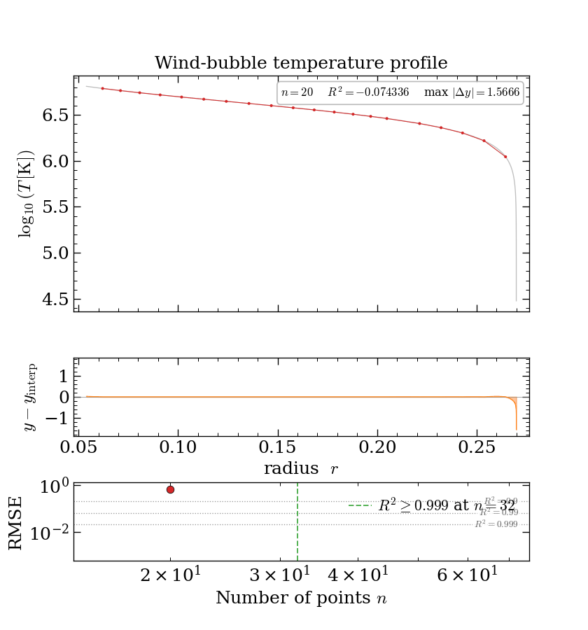
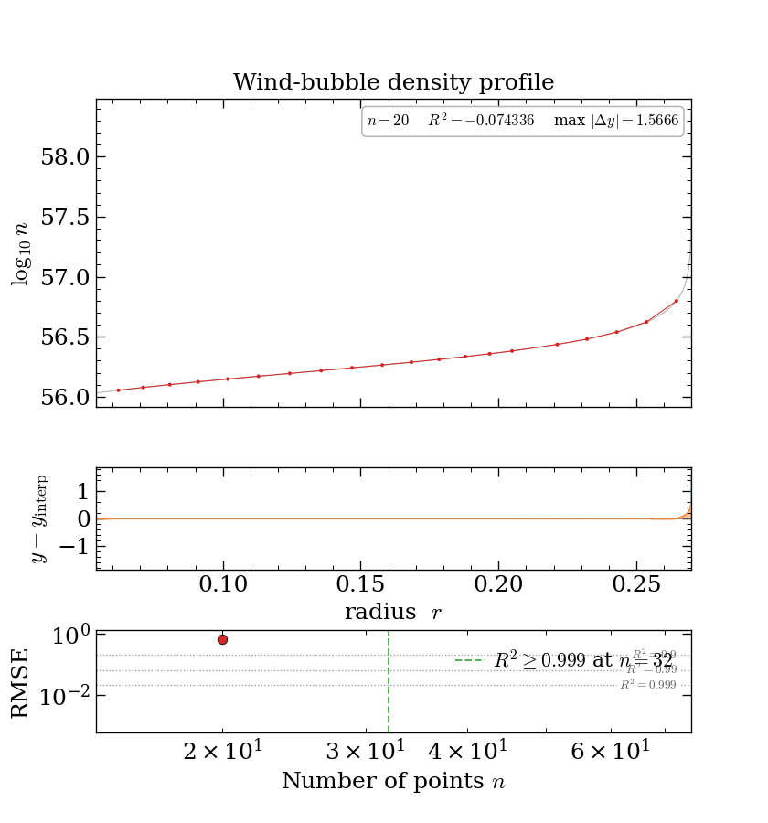
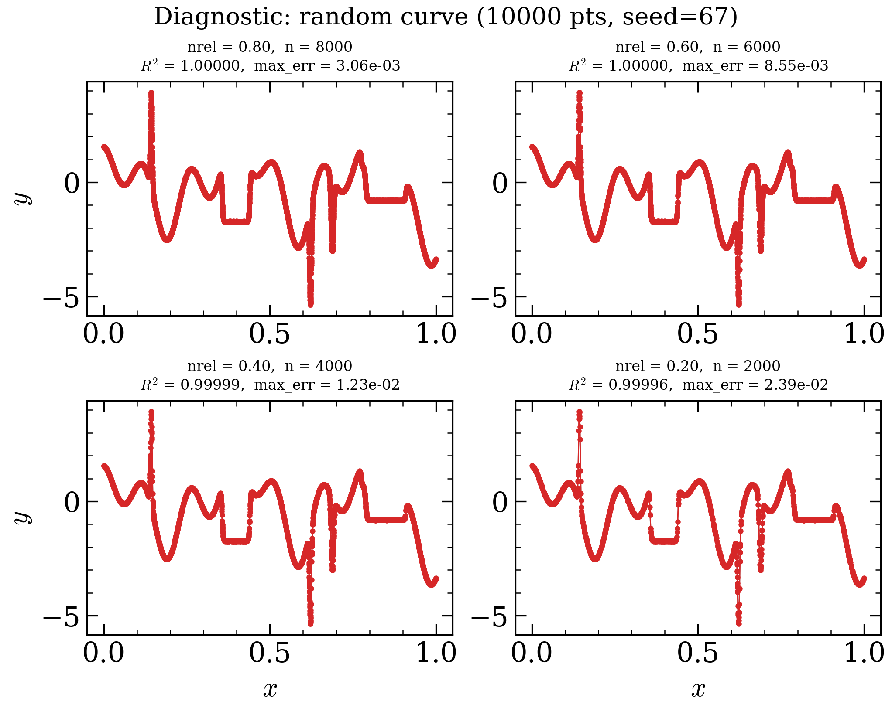

# simplify

[](LICENSE)


Heuristic downsampling of 1-D curves while preserving sharp bends, local
extrema, and overall shape. Single file, no dependencies beyond NumPy.


The animation progressively adds points to a 10 000-point random test
curve (seed 42, no noise).  Three panels: the simplified overlay (top),
the signed residual showing where the approximation over-/undershoots
(middle), and RMSE vs point count on a log-log scale (bottom).  R² ≥ 0.9
is first reached at **n = 34** (green dashed line).  Generated with:

```bash
python simplify.py --random --seed 42 --no-noise --animate demo_nonoise.gif --animate-duration 5
```

### Real data — Starburst99 5 Myr SED

| default | `max_err = 0.05` |
|:---:|:---:|
|  |  |
| 1221 pts → **358** pts (3.4× compression) | 1221 pts → **360** pts (3.4× compression) |

The curve is the Starburst99 `LOG (TOTAL)` SED column at 5 Myr
(instantaneous burst, Z = Z☉) — a real astrophysical spectrum spanning
91 Å to 1.6 × 10⁶ Å in wavelength and ~6 dex in luminosity.  `x` is
`log10(λ/Å)` and `y` is `log10(L_λ / (erg s⁻¹ Å⁻¹))`.  The left GIF
shows the default simplification — the arc-length sampler distributes
points symmetrically across the curve's normalised `[0, 1]²` length.
Its global R² is excellent, yet the worst-case error still reaches
0.22 dex at the sharp UV/Balmer-jump feature (the spike in the residual
panel).  The right GIF adds `max_err = 0.05`, which inserts points at
the worst-error locations until no point deviates by more than 0.05 dex
(≈ 12 %); just two extra points pull the worst-case error down to
0.01 dex.  Generated with:

```bash
python simplify.py --randomSB99 --animate demo_sb99_loose.gif --animate-duration 6 --r2-target 0.999
python simplify.py --randomSB99 --animate demo_sb99_tight.gif --animate-duration 6 --r2-target 0.999 --max-err 0.05 --log-y off
```

(The SB99 `y` is already `log₁₀ L`, so `--log-y off` treats it linearly
and `--max-err 0.05` means ≤ 0.05 dex. `--max-err` always needs an
explicit `--log-y on|off` so its units are unambiguous.)

### In reality, curves are much simpler

The random test curve at the top is a deliberate worst case — dense,
noisy, and full of competing wiggles. The curves you *actually* want to
downsample are usually far tamer. A common case is a radial
temperature or density profile from a simulation: a smooth bulk with one
or two sharp transitions and a lot of redundant samples in between.

Below are the temperature `T(r)` and density `n(r)` profiles from the
interior of a stellar-wind bubble (model `4e3_sfe001_n5e2_PL0`).
Temperature falls gently then plunges at the bubble edge; density rises
then spikes at the same radius — the contact discontinuity where the hot
interior meets the cool swept-up shell.

| temperature `log₁₀ T(r)` | density `log₁₀ n(r)` |
|:---:|:---:|
|  |  |

These profiles are sampled on a **100-point** radial grid. About
**32 points reproduce either curve to R² ≥ 0.999** (bottom panel, green
line). The bend detector spends its budget on the sharp edge and barely
touches the smooth interior, which is exactly the behaviour you want for
astrophysical density/temperature/flux profiles.

## Contents

- [In reality, curves are much simpler](#in-reality-curves-are-much-simpler)
- [Installation](#installation)
- [Quick start](#quick-start)
- [Command line](#command-line)
- [Choosing `nmin` and `max_err` (diagnostic mode)](#choosing-nmin-and-max_err-diagnostic-mode)
- [Python API](#python-api)
- [Input and output format](#input-and-output-format)
- [How it works (the short version)](#how-it-works-the-short-version)
- [Algorithm](#algorithm)
- [Parameters](#parameters)
- [Multi-decade data](#multi-decade-data-density-temperature-flux-profiles)
- [Limitations](#limitations)
- [Dependencies](#dependencies)
- [License](#license)
- [Testimonials](#testimonials)

## Installation

`simplify` is a single file with no packaging — just clone the repo and
run it in place:

```bash
git clone https://github.com/JiaWeiTeh/simplify.git
cd simplify
pip install numpy            # matplotlib too, for --plot / --animate
python simplify.py --help
```

To use it from your own project, copy `simplify.py` next to your code (or
add this directory to your `PYTHONPATH`) and `import simplify`.

## Quick start

```bash
python simplify.py --random --no-noise --animate simplify.gif
```

Generates a synthetic test curve and an animated GIF of the
simplification process. Other quick demos:

```bash
python simplify.py --random --metrics                          # error table
python simplify.py --random --diagnostic                       # size/error sweep
python simplify.py --random --plot                             # comparison plot
python simplify.py --random --animate demo.gif                 # animated GIF
python simplify.py --randomSB99 --animate sb99.gif             # real SED data
python simplify.py --randomSB99 --max-err 0.05 --log-y off --animate sb99_tight.gif  # bounded error (--max-err needs explicit --log-y)
```

## Command line

```bash
python simplify.py data.csv -o reduced.csv                    # basic
python simplify.py data.csv --metrics --plot                   # inspect quality
python simplify.py data.csv --nmin 200                         # denser output
python simplify.py data.csv --max-err 0.1 --log-y off          # bound worst-case error (--max-err needs explicit --log-y)
python simplify.py data.csv --animate output.gif               # animation
python simplify.py data.csv --grad-inc 0.5                     # lower curvature threshold
```

Run `python simplify.py --help` for all options.

## Choosing `nmin` and `max_err` (diagnostic mode)

Not sure how aggressively to downsample, or what `--max-err` to ask for?
`--diagnostic` sweeps a handful of *relative* output sizes
(`nrel = n_out / n_orig`) and prints what each one buys you — the point
count, the worst-case error, and the R². Each row keeps **exactly**
`round(nrel · n_orig)` points: the most important ones first (ranked by
greedy worst-error refinement — the same mechanism `--max-err` uses), so a
larger `nrel` over-populates the curve with progressively less important
points while a smaller one keeps only the sharpest features. It runs
instead of the normal conversion, so no output file is written.

```bash
python simplify.py --random --seed 67 --diagnostic
```

```text
  Diagnostic: random curve (10000 pts, seed=67)
  n_orig = 10000    working space: linear-y
  --------------------------------------------------------
   nrel    n_out   compression      max_err        R^2
  --------------------------------------------------------
   0.80     8000          1.2x    3.056e-03   1.000000
   0.30     3000          3.3x    1.573e-02   0.999976
   0.10     1000         10.0x    2.921e-02   0.999922
   0.01      100        100.0x    8.997e-02   0.999665
  --------------------------------------------------------
  max_err = worst-case |error| in linear-y space (pass as --max-err).
```

Read it as a budget-vs-accuracy curve: even at `nrel = 0.01` (100 points, a
100× compression) R² is still 0.9997 and the worst-case error is 0.09, and
every extra slice of budget shaves the worst case down further (0.029 at
10 %, 0.016 at 30 %, 0.003 at 80 %). The `max_err` column is the direct
guide to `--max-err`: if you can live with a ~0.03 worst-case error,
`nrel = 0.1` (a 10× compression) is plenty; if you need 0.003, you'll want
closer to `nrel = 0.8`.

The reported `max_err` and `R^2` are always in the y-space the pipeline
optimised — **dex when `log_y` is active**, linear otherwise — so the
`max_err` value drops straight into `--max-err`. Customise the targets with
`--nrels`, and add `--plot` (or `--plot-save PATH`) to draw a near-square
grid of before/after panels (4 → 2×2, 5–6 → 2×3, 7–9 → 3×3, …):

```bash
python simplify.py --random --seed 67 --diagnostic --nrels 0.9,0.5,0.25 --plot
```



From Python the same sweep returns a list of per-`nrel` dicts (with the
metrics and the simplified arrays) so you can drive parameter selection
programmatically:

```python
from simplify import _random_test_curve, _simplify_diagnostic

x, y = _random_test_curve(seed=67)
rows = _simplify_diagnostic(x, y, nrels=[0.6, 0.3], plot=False)
print(rows[0]["n_out"], rows[0]["max_err"], rows[0]["r_squared"])
```

## Python API

```python
import numpy as np
from simplify import _simplify, _simplify_error, _simplify_plot

x = np.linspace(0, 10, 10000)
y = np.sin(x) + 0.5 * np.sin(5 * x)

# Simplify (default warn_below_r2 = 0.9)
x_s, y_s = _simplify(x, y)

# Higher nmin for denser output
x_s, y_s = _simplify(x, y, nmin=200)

# Bound the worst-case vertical error.  max_err's units depend on the
# y-space, so log_y must be explicit: 0.1 in y-units (log_y=False) or
# 0.1 dex (log_y=True).
x_s, y_s = _simplify(x, y, max_err=0.1, log_y=False)

# Error metrics
metrics = _simplify_error(x, y, x_s, y_s)
print(f"R² = {metrics['r_squared']:.4f}, compression = {metrics['compression']:.1f}x")

# Plot
_simplify_plot(x, y, x_s, y_s, save_path="comparison.png")
```

## Input and output format

The CLI reads a plain two-column text file of `x y` pairs, one sample per
line, sorted or unsorted (it is sorted internally by `x`):

- **`.csv` files** are read comma-delimited; **any other extension** is
  read whitespace-delimited.
- Lines beginning with `#` are treated as comments and skipped, so a
  header row like `# x,y` is fine.
- Exactly two columns are expected: the first is `x`, the second is `y`.

```text
# x,y
0.0,1.000
0.1,0.995
0.2,0.980
...
```

Output is written with `--output/-o` (default `simplified_output.csv`) as
a comma-delimited file with a `# x,y` header — the same format the reader
accepts, so simplified files can be fed straight back in.

## How it works (the short version)

You have a curve with thousands of points and you want to keep only the
few that matter. Which ones matter? `simplify` answers that with four
simple ideas:

- **Keep the bends.** Where the curve turns sharply, you need a point to
  capture the corner. Long straight stretches barely need any.
- **Keep the peaks and valleys.** The high and low points are what your
  eye remembers, so they always make the cut.
- **Spread the rest out fairly.** Don't crowd every point into the busy
  region — make sure every part of the curve gets some representation,
  and rank features by how *important* they are so the big ones never
  get dropped.
- **Check the error and clean up.** Measure how far the simplified curve
  strays from the original. Drop any leftover point that sits on a
  straight line between its neighbours (it adds nothing), and optionally
  keep adding points back until the worst gap is under a limit you set.

That's it. The section below is the same four ideas spelled out
precisely, with the math and the edge cases.

## Algorithm

The input is sorted by x and near-duplicate consecutive samples are
collapsed (ODE-solver stagnation).  Three independent feature detectors
populate a candidate pool, a topological-persistence filter marks the
visually important extrema as mandatory, x-uniform coverage promotes
one point per chunk, an optional greedy loop bounds the worst-case
pointwise error, and a final collinearity pass removes points that lie
on the chord between their neighbours:

1. **Scale-invariant bend detection** — Menger curvature κ (the
   reciprocal of the circumradius of each consecutive triplet) is
   computed in *normalised* `(x, y)` coordinates (both rescaled to
   `[0, 1]`). A point is flagged when κ exceeds `grad_inc`.  Running
   in normalised coordinates makes `grad_inc` dimensionless — the same
   value works at any axis scale.

2. **Refined sign-change detection** — every point where the first
   derivative changes sign is a candidate extremum.  Because the
   sign flip occurs between consecutive samples, the refinement picks
   whichever of the two neighbours is more extreme (higher for a max,
   lower for a min).

3. **Arc-length sampling** — the differential arc length
   `ds = sqrt((Δx/range_x)² + (Δy/range_y)²)` in normalised
   `[0, 1]²` coordinates treats both axes symmetrically.  The
   cumulative arc length is divided into `nmin` equal bins and one
   point is selected at each bin boundary — dense where the curve
   changes rapidly, sparse where it is flat.  Unlike the older
   y-only metric `sum(|Δy|)`, a long gentle slope receives points
   proportional to its x-span, which prevents high-amplitude regions
   from starving gradual ones.

4. **Topological persistence (mandatory set)** — for each extremum,
   `_peak_prominences` computes the peak prominence (minimum descent
   from a local max, or ascent from a local min, needed to reach a
   strictly more extreme point) in a single O(n log n) monotonic-stack
   pass. Extrema with prominence ≥ 5 % of the y-range are marked
   **mandatory** and always retained, so big features never flicker
   in and out with changing `nmin`.

4b. **X-uniform mandatory coverage** — the x-domain is split into 20
   equal-width chunks and the feature-pool point nearest each chunk
   centre is promoted into the mandatory set alongside the prominent
   extrema.  This thin x-uniform skeleton guarantees every part of
   the x-axis gets at least one retained point, complementing the
   arc-length sampler for chunks with very little curve length per
   x-span.

5. **Greedy max-error reduction** — when `max_err` is set, a greedy
   loop finds the original data point with the largest vertical
   (fixed-x) interpolation error and inserts it into the retained set,
   repeating until the worst-case absolute error drops below `max_err`.
   The tolerance lives in the working y-space, so its units depend on
   `log_y` (dex when on, raw y-units when off) — which is why `log_y`
   must be set explicitly alongside `max_err`.  Points inserted by this
   loop are protected from the subsequent collinearity prune.

6. **Collinearity prune** — a vectorised sweep drops any point whose
   y value is within 0.1 % of the y-range of the chord between its
   two surviving neighbours. Endpoints, mandatory extrema, and
   `max_err` insertions are protected. This removes redundant samples
   on linear and horizontal segments.

After all stages, the output's R² is checked against `warn_below_r2`
and a `UserWarning` is emitted if it falls short — purely
informational, the output is not changed.

## Parameters

| Parameter | Default | Description |
|-----------|---------|-------------|
| `nmin` | 100 | Target minimum output samples for arc-length sampling |
| `grad_inc` | 1.0 | Bend sensitivity (dimensionless, scale-invariant); fires when Menger curvature in normalised coords > `grad_inc` |
| `warn_below_r2` | 0.9 | Soft R² quality threshold; a `UserWarning` is emitted when the output falls below this value.  Pass `None` to disable. |
| `max_err` | `None` | Maximum allowed absolute **vertical** (fixed-x) interpolation error — the error you incur using the curve as a function of x. A greedy loop inserts points until no sample deviates by more than this. **Units follow `log_y`:** raw y-units when `log_y=False`, dex when `log_y=True` (so `0.1` is ≤ 0.1 dex ≈ 26 % in log mode). Because of this bond, `log_y` **must** be set explicitly (`True`/`False`) when `max_err` is used — `log_y="auto"` raises. |
| `log_y` | `"auto"` | Work in log-y space for every internal feature detector.  `"auto"` activates when every `y > 0` and `max(y)/min(y) > 100`; pass `True` / `False` to force. Also fixes the units of `max_err`, so it cannot stay `"auto"` when `max_err` is set. |
| `dedup_tol` | `1e-6` | Stagnation tolerance for collapsing near-duplicate consecutive samples (ODE-solver artefact). A `UserWarning` reports how many points were collapsed when it fires. Set to `0` to disable, or smaller to collapse fewer. |

## Multi-decade data (density, temperature, flux profiles)

Astrophysical profiles that span several orders of magnitude — e.g.
density or temperature inside an interstellar bubble, where ISM
(~1 cm⁻³) to shocked shell (~10⁶ cm⁻³) is routine — need log-y
handling, because the linear arc-length sampler would be dominated by
the peak amplitude.  `log_y="auto"` (the default) switches every
internal detector onto `log10(y)` when the input is strictly positive
and spans ≥ 2 decades; the output arrays still contain the caller's
raw `y` values.

The `_simplify_error` helper and the CLI's `--metrics` flag report
`log_r_squared`, `log_rms_err`, and `log_max_dex_err` whenever `y` is
strictly positive, so quality assessments on such data are in the
right scale by default.  When rendering, use `plt.semilogy` (or equivalent)
on the simplified points — that interpolates between them in log-y
space, which is what the algorithm's internal arc-length sampler assumed.

## Limitations

- **1-D functions only.** The input must be a single-valued curve `y(x)`.
  Closed loops, self-intersecting paths, or multi-valued data are not
  supported — points are sorted by `x` before processing.
- **Heuristic, not optimal.** The point selection is a fast set of
  heuristics, not a globally optimal solver (e.g. it does not minimise
  point count for a given error bound the way Douglas–Peucker variants
  do). It aims for visually faithful results, not provable minima.
- **Tuned for smooth scientific curves.** Heavily noisy data can trip the
  bend and sign-change detectors into keeping noise spikes; pre-smoothing
  or a higher `grad_inc` helps.
- **`log_y` needs positive data.** Log-space handling only activates when
  every `y > 0`. Curves crossing zero stay in linear space.
- **No streaming.** The whole curve is loaded and processed in memory; it
  is not designed for out-of-core or online/streaming use.

## Dependencies

- **numpy** (required)
- **matplotlib** (optional — plotting and animation)

## License

Released under the [MIT License](LICENSE).

## Testimonials

> *"It's good. It's peer reviewed."*

> *"It's amazing!"* — Karin

> *"It simplifies my life."* — Philipp
